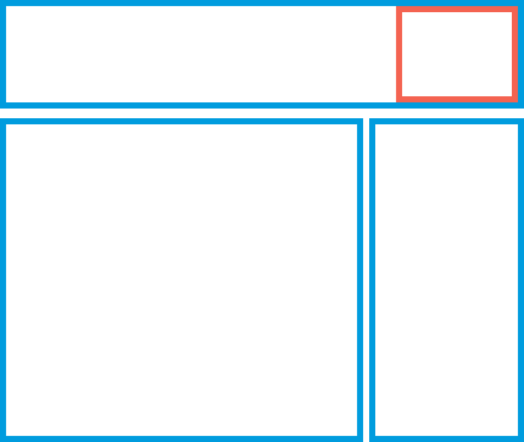

<div class="section-inner">

# Placeholders and lazy builders

</div>

|
|
|

<div class="section-inner">

### What's in a placeholder

<div class="col-2">

<div class="col">



</div>

<div class="col">

A placeholder is a _substitute_ of a part of the page<br>
that will be rendered _later_

It is closely related to lazy builders. A lazy builder <br>
indicates _how_ to render the placeholder.

Placeholders need a _strategy_ to be rendered.

</div>

</div>

</div>

|
|
|

<div class="section-inner">

### Declaring a lazy builder

```php
  public function build() {
    $build['time'] = [
      '#lazy_builder' => [self::class . '::lazyBuilder', []],
      '#cache' => ['max-age' => 60]
    ];
    return $build;
  }

  public static function lazyBuilder() {
    $now = new DateTime();
    return [
      '#markup' => t("Today is @date", ['@date' => $now->format('d-m-Y H:i')]),
    ];
  }
```

<div class="font-xs fragment">

(It's basically a _callback_)

</div>

</div>

|
|
|

<div class="section-inner">

### You already benefit from lazy builders...

<div class="fragment">

Why? Because lazy builders are _mandatory_<br> for placeholders to work.

```php
/* PlaceholderGenerator.php*/
public function canCreatePlaceholder(array $element) {
  // If generated by a #lazy_builder callback,
  // placeholdering is possible.
  return isset($element['#lazy_builder']);
}
```

</div>

<!-- .element: class="fragment" -->

In order to enable auto-placeholdering, Drupal core<br>
**implement many lazy builders.**

<!-- .element: class="fragment" -->

<div class="alert fragment">

This enables a great out-of-the-box experience, but somewhat _hides_ the inner workings from the developer sight.

</div>

</div>

|
|
|

<div class="section-inner">

`BlockViewBuilder.php`

```php[1-23|11-21]
public function viewMultiple() {
  foreach ($entities as $entity) {
    (...)
    if ($plugin instanceof ...) {
      // Immediately build a #pre_render-able block, since this block cannot
      // be built lazily.
      $build[$entity_id] +=
        static::buildPreRenderableBlock($entity, $this->moduleHandler());
    }
    else {
      // Assign a #lazy_builder callback, which will generate a #pre_render-
      // able block lazily (when necessary).
      $build[$entity_id] += [
        '#lazy_builder' => [static::class . '::lazyBuilder', [
            $entity_id,
            $view_mode,
            $langcode
          ]
        ],
      ];
    }
  }
}
```

<div class="font-xs fragment">

(Exceptions are MainContent and Title)

</div>

</div>

|
|
|

<div class="section-inner">

### Lazy Builders express the _how_<span class="fragment">,<br> but _who_ decides _what_ to placeholder?</span>

<div class="fragment">

A) Drupal, via the auto placeholdering conditions on `services.yml`<br>

```yml
parameters:
  renderer.config:
    auto_placeholder_conditions:
      # Max-age at or below which caching is not considered worthwhile.
      max-age: 0
      # Cache contexts with a high cardinality.
      contexts: ["session", "user"]
      # Tags with a high invalidation frequency.
      tags: []
```

This means that _every render array_ that 1) has a lazy builder<br> and 2) meets this criteria will be placeholdered

</div>

</div>

|
|
|

<div class="section-inner">

### Lazy Builders express the _how_,<br> but _who_ decides _what_ to placeholder?</span>

<div class="fragment">

B) **The developer (you)**

</div>
<div class="fragment">

B.1) By identifying extra conditions to add to `auto_placeholder_conditions`

</div>
<div class="fragment">

B.2) Manually!

```php [3]
$build = [
  '#lazy_builder' => [static::class . '::renderMessages', [$element['#display']]],
  '#create_placeholder' => TRUE,
];
```

</div>

</div>

|
|
|

<div class="section-inner">

`announcements_feed.module`

```php [4-15]
function announcements_feed_toolbar() {
  $items['announcement'] = [
    '#type' => 'toolbar_item',
    'tab' => [
      '#lazy_builder' => [
        'announcements_feed.lazy_builders:renderAnnouncements',
        [],
      ],
      '#create_placeholder' => TRUE,
      '#cache' => [
        'tags' => [
          'announcements_feed:feed',
        ],
      ],
    ],
    '#wrapper_attributes' => [
      'class' => ['announce-toolbar-tab'],
    ],
    '#cache' => ['contexts' => ['user.permissions']],
    '#weight' => 3399,
  ];
```

</div>

|
|
|

<div class="section-inner">

`CommentViewBuilder.php`

```php
if ($display->getComponent('links')) {
  $build[$id]['links'] = [
    '#lazy_builder' => [
      'comment.lazy_builders:renderLinks',
      [
        $entity->id(),
        $view_mode,
        $entity->language()->getId(),
        !empty($entity->in_preview),
      ],
    ],
    '#create_placeholder' => TRUE,
  ];
}
```

</div>

|
|
|

<div class="section-inner">

`ShortcutsBlock.php`

```php
public function build() {
  return [
    '#lazy_builder' => ['shortcut.lazy_builders:lazyLinks', [FALSE]],
    '#create_placeholder' => TRUE,
    '#cache' => [
      'keys' => ['shortcut_set_block_links'],
      'contexts' => ['user'],
    ],
  ];
}
```

</div>

|
|
|

<div class="section-inner">

### What shape takes a placeholder?

A placeholder is made up of two parts:

The **placeholder** itself,<br>
which is a `#markup` that can be stored on cache

An `[#attached][placeholders]` entry with the info<br>
on how to replace it.

</div>

|
|
|

<div class="section-inner">

```php [2-3|4-16]
[
  "#markup" => "<drupal-render-placeholder callback arguments token >
    </drupal-render-placeholder>",
  "#attached" => [
    "placeholders" => [
      "<drupal-render-placeholder ...> </drupal-render-placeholder>" => [
        "#cache" => [
          "tags": ...,
        ],
        "#lazy_builder" => [
          "Drupal\block\BlockViewBuilder::lazyBuilder",
          [...]
        ]
      ]
    ]
  ]
]
```

</div>

|
|
|

<div class="section-inner">

## Placeholders are mainly a _potential_

To become an _act_, they interact with<br>
other Drupal systems.

Especially, with the cache systems.

</div>

|
|
|

<div class="section-inner">

### Placeholder strategies

Placeholders are rendered by a `Strategy`

The `SingleFlushStrategy` is the default and<br>
renders the placeholders on an `EventSubscriber` that fires<br>
after `HtmlResponseSubscriber`.

It is _blocking_.

</div>
