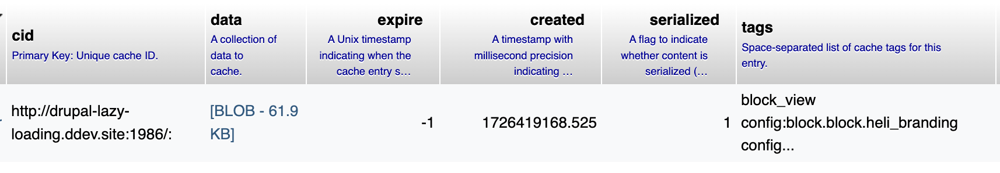

<div class="section-inner">

# Let's put it all together

</div>

|
|
|

<div class="section-inner">

## A table of possible scenarios

| Page cache      | Dynamic Page Cache | Big Pipe        | Result                                                                                                                                                                                                                  |
| --------------- | ------------------ | --------------- | ----------------------------------------------------------------------------------------------------------------------------------------------------------------------------------------------------------------------- |
| Disabled        | Disabled           | Disabled        | <span class="font-sm">Functionally the same as above - we've just moved the execution to the placeholder. Render cache still helping. </span>                                                                           |
| ✅&nbsp;Enabled | Disabled           | Disabled        | <span class="font-sm">When possible, anonymous pages are cached. Logged users are never cached. Placeholders are not stored on cache page result - they are processed before.</span>                                    |
| ✅&nbsp;Enabled | ✅&nbsp;Enabled    | Disabled        | <span class="font-sm">When possible, pages are cached minus the placeholdered parts. Placeholders are replaced at render time on top of the cached HTML markup. </span>                                                 |
| ✅&nbsp;Enabled | ✅&nbsp;Enabled    | ✅&nbsp;Enabled | <span class="font-sm">When possible, pages are cached minus the placeholdered parts. Pages are served to the browser with the placeholders, and they get replaced via Javascript on subsequent requests via AJAX</span> |

</div>

|
|
|

<div class="section-inner">

### Let's use our TimeBlock

A block that renders the current time and
has a max-age of 60 seconds, thus making our page
poorly cacheable.

```php
  public function build() {
    $now = new DateTime();
    $build['time'] = [
      '#markup' => t("Today is @date", ['@date' => $now->format('d-m-Y H:i')]),
    ];
    return $build;
  }

  public function getCacheMaxAge() {
    return 60;
  }
```

</div>

|
|
|

<div class="section-inner">

...plus a setting for placeholders<br> that enables autoplaceholdering for it.

```yml [4]
parameters:
  renderer.config:
    auto_placeholder_conditions:
      max-age: 90
      contexts: []
      tags: []
```

</div>

|
|
|

<div class="section-inner">

## Case 1: nothing at all

| Page cache | Dynamic Page Cache | Big Pipe | Result                                                       |
| ---------- | ------------------ | -------- | ------------------------------------------------------------ |
| Disabled   | Disabled           | Disabled | The page is re-rendered on each request. Render cache helps. |

</div>

|
|
|

<div class="section-inner">

Our block can be placeholdered or not<br>
but it makes no big difference.

Our cache tags, contexts and max-age (60)<br>
bubble up to the page, but there's nobody to use them.

The page is re-rendered **each time**.

</div>

|
|
|

<div class="section-inner">

### Thanks, render cache

The only thing that alleviates our poor performance<br>
is the **render cache**

<br>

Our block output is getting cached for 60 seconds.<br>

At least, when re-rendering the page, individual parts of it<br>
can be retrieved from the cache.

</div>

|
|
|

<div class="section-inner">

|              | Session                                                  | Session-less |
| ------------ | -------------------------------------------------------- | ------------ |
| First MISS   | Rebuilds all page,<br> stores parts in cache_render      |              |
| N+1 MISS     | Rebuilds all page,<br> retrieves parts from cache_render |              |
| Placeholders | Replaced on SingleFlushStrategy                          |              |

</div>

|
|
|

<div class="section-inner">

## Case 2: Page Cache for session-less requests.

| Page cache      | Dynamic Page Cache | Big Pipe | Result                                                                                                                                                  |
| --------------- | ------------------ | -------- | ------------------------------------------------------------------------------------------------------------------------------------------------------- |
| ✅&nbsp;Enabled | Disabled           | Disabled | When possible, session-less pages are cached. Requests with session (logged users, anonymous carts, etc) are never cached. Placeholders are not stored. |

</div>

|
|
|

<div class="section-inner">

### Some improvements and some problems

|                       | Session                                             | Session-less                                                                                  |
| --------------------- | --------------------------------------------------- | --------------------------------------------------------------------------------------------- |
| Cache MISS            | Rebuilds all page,<br> stores parts in cache_render | Rebuilds all page,<br> stores parts in cache_render,<br> 👍**stores full page on cache_page** |
| Cache HIT             |                                                     | 👍**Retrieves full page from cache_page**                                                     |
| Placeholders          | Replaced on SingleFlushStrategy                     | Replaced on SingleFlushStrategy<br> before storing result on cache                            |
| Uncacheable<br> pages | Always                                              | 👍**Never**                                                                                   |

</div>

|
|
|

<div class="section-inner">

#### Page Cache has a long-standing issue <br> where `max-age` is ignored

```php[1-6|4]
$build['give_me_time'] = [
  '#markup' => t("Today is @date", ['@date' => $now->format('d-m-Y H')]),
  '#cache' => [
    'max-age' => 3600, // <-- Will be ignored
  ],
];
```

<br>

<div class="font-sm">

[pp-3] Bubbling of elements' max-age to the page's headers and the page cache
https://www.drupal.org/project/drupal/issues/2352009

(you can use Cache Control Override module around the max-age issue:<br>
https://www.drupal.org/project/cache_control_override)

</div>

</div>

|
|
|

<div class="section-inner">

For anonymous users, full page output is cached but<br>
max-age is not bubbled: **we have lost our TimeBlock!**

Also, the stored page is the fully rendered HTML<br>
(including the processed placeholders) so... <br>
**we haven't seen their potential yet**.

</div>

|
|
|

<div class="section-inner">

## Case 3: Dynamic Page Cache

| Page cache      | Dynamic Page Cache | Big Pipe | Result                                                                                                                                                                      |
| --------------- | ------------------ | -------- | --------------------------------------------------------------------------------------------------------------------------------------------------------------------------- |
| ✅&nbsp;Enabled | ✅&nbsp;Enabled    | Disabled | <span class="font-sm">When possible, pages are cached minus the placeholdered parts.<br> Placeholders are replaced at render time on top of the cached HTML markup. </span> |

</div>

|
|
|

<div class="section-inner">


</div>

|
|
|

<div class="section-inner">

### Placeholdering... finally!

|                       | Session (dynamic_page_cache)                                                                    | Session-less (page_cache)                                                              |
| --------------------- | ----------------------------------------------------------------------------------------------- | -------------------------------------------------------------------------------------- |
| Cache MISS            | Rebuilds all page,<br> stores parts in cache_render, <br> 👍**stores result with placeholders** | Rebuilds all page,<br> stores parts in cache_render<br> stores full page on cache_page |
| Cache HIT             | 👍**Retrieves page from dynamic page cache,<br> replaces placeholders**                         | Retrieves full page from cache_page                                                    |
| Placeholders          | Replaced on SingleFlushStrategy                                                                 | Replaced on SingleFlushStrategy<br> before storing result on cache                     |
| Uncacheable<br> pages | 👍**Almost never**                                                                              | Never                                                                                  |

</div>

|
|
|

<div class="section-inner">

Now, we hit a page that has the block and go check<br>
the `cache_dynamic_page_cache` database table.

Our placeholder sits there

```html
<div class="page__sidebar col-lg-3">
  <drupal-render-placeholder
    callback="Drupal\block\BlockViewBuilder::lazyBuilder"
    arguments="0=heli_timeblock&amp;1=full&amp;2"
    token="zwKpkDD6cjGP-7xbKPtQswFLKRq0zkJDjbaCAJ3X4gk"
  ></drupal-render-placeholder>
</div>
```

|
|
|

<div class="section-inner">

#### Uncacheable: _almost_ never??

This is the _magic trick_ Dynamic Page Cache pulls from its hat:

On `DynamicPageCacheSubscriber` we learn that a response can be deemed uncacheable.

```php
  // There's no work left to be done if this is an uncacheable response.
  if (!$this->shouldCacheResponse($response)) {
    // The response is uncacheable, mark it as such.
    $response->headers->set(self::HEADER, 'UNCACHEABLE');
    return;
  }
```

</div>

|
|
|

<div class="section-inner">

#### Case 4: Uncacheable: _almost_ never??

The code says: if any of our auto-placeholdering<br>
conditions is met, the response is uncacheable.

**BUT**

Drupal has already _removed_ those parts and set<br>
placeholders instead, so the cache tags, etc... did not bubble.<br>

The offending (uncacheable) conditions should be _absent_

<div class="alert">

This is a crucial point to hunt for performance issues: check for `X-Drupal-Dynamic-Cache: UNCACHEABLE` headers and investigate.<br> In theory, this shouldn't happen ever.

</div>

|
|
|

<div class="section-inner">

By _removing_ highly dynamic parts from the cached HTML

· We greatly increase the ratio of HITs

· We can defer loading of dynamic parts using other `PlaceholderStrategies`

|
|
|

<div class="section-inner">

## Case 4: Big Pipe - All In

| Auto placeholder | Page cache      | Dynamic Page Cache | Big Pipe        | Result                                                                                                                                                                                                                                   |
| ---------------- | --------------- | ------------------ | --------------- | ---------------------------------------------------------------------------------------------------------------------------------------------------------------------------------------------------------------------------------------- |
| ✅&nbsp;Enabled  | ✅&nbsp;Enabled | ✅&nbsp;Enabled    | ✅&nbsp;Enabled | <span class="font-sm">When possible, and for logged in users, pages are cached minus the placeholdered parts. Pages are served to the browser with the placeholders, and usually get replaced via Javascript on a chunked stream.</span> |

</div>

|
|
|

<div class="section-inner">

|                       | Session (dynamic_page_cache + big_pipe)                                                                                  | Session-less (page_cache)                                          |
| --------------------- | ------------------------------------------------------------------------------------------------------------------------ | ------------------------------------------------------------------ |
| Cache MISS            | Rebuilds all page,<br> stores parts in cache_render, <br> stores full result with placeholders                           | Rebuilds all page,<br> stores parts in cache_render                |
| Cache HIT             | Retrieves page from dynamic cache,<br> 👍**streams it to the browser with info to <br> lazily replace the placeholders** | Retrieves full page from cache_page                                |
| Placeholders          | 👍**Replaced with BigPipeStrategy**                                                                                      | Replaced on SingleFlushStrategy<br> before storing result on cache |
| Uncacheable<br> pages | Almost never                                                                                                             | Never                                                              |

</div>

|
|
|

<div class="section-inner">

### Big Pipe: a new PlaceholderStrategy

Finally we get a different `PlaceholderStrategy`!

The server will receive the HTML with the placeholders<br>
still present (with an specific markup)

```html
<span
  data-big-pipe-placeholder-id="
    callback=Drupal%5Cblock%5CBlockViewBuilder%3A%3AlazyBuilder&amp;
    args%5B0%5D=heli_timeblock&amp;
    args%5B1%5D=full&amp;
    args%5B2%5D&amp;
    token=zwKpkDD6cjGP-7xbKPtQswFLKRq0zkJDjbaCAJ3X4gk"
></span>
```

</div>

|
|
|

<div class="section-inner">

#### Actually...

BigPipe has two strategies: with or without JS.

The response is _streamed_ to the browser in chunks.<br>
The browser can process and render the first chunks while still<br>
receiving data.

The most common is the JS-based,<br>
and the response is divided on three parts.

</div>

|
|
|

<div class="section-inner">
<div class="bigpipe">
<div class="bigpipe-1">

The entire page until the closing `</body>`, with the placeholders.

</div>
<div class="bigpipe-2">

Replacement values for the placeholders (scripts)

```html
<script
  type="application/vnd.drupal-ajax"
  data-big-pipe-replacement-for-placeholder-with-id="callback=user.toolbar_link_builder%3ArenderDisplayName&amp;&amp;token=XGROnxBLjNjdNZJ_VcOhVZtenx2tDkIKPfojS_uZFXA"
>
  [{"command":"insert","method":"replaceWith","selector":"[data-big-pipe-placeholder-id=\u0022callback=user.toolbar_link_builder%3ArenderDisplayName\u0026\u0026token=XGROnxBLjNjdNZJ_VcOhVZtenx2tDkIKPfojS_uZFXA\u0022]","data":"admin","settings":null}]
</script>
```

</div>
<div class="bigpipe-3">

`</body>` and everything after it

</div>

</div>

</div>

|
|
|

<div class="section-inner">

This means the first _chunk_ of the page is<br>
already loaded when replacements enter.

This is 👍*incredible* for perceived performance.

This is 👍*amazing* for performance in general.<br><br>

<div class="bigpipe">
<div class="bigpipe-1">

I'm already loaded!<br>
I'm usually a cache HIT from dynamic page cache!<br>
I'm _fast_

</div>
<div class="bigpipe-2">
loading...
</div>

<div class="bigpipe-3">
loading...
</div>

</div>

</div>

|
|
|

<div class="section-inner">

<br>

And this is...

👎*hurtful* for CLS (Cumulative Layout Shift)

and 👎❓*potentially damaging* for LCP (Largest Contentful Paint)

</div>
