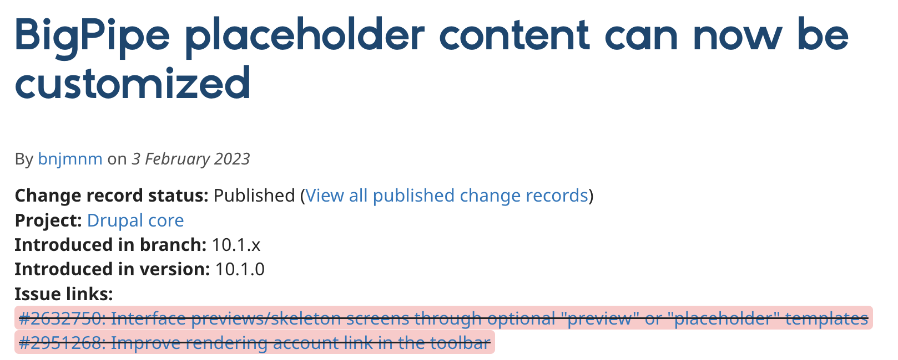
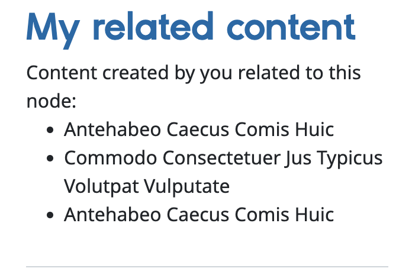

<div class="section-inner">

# Placeholdering previews against CLS problems

</div>

|
|
|

<div class="section-inner">

## The problem with CLS

Lazyly rendering parts of the page can cause<br>
reflows and moving parts, as the content appears over time.

<div class="cls">

<div class="cls-lazy"></div>

<div class="cls-eager"></div>

</div>

This is _exactly_ what CLS penalizes as a bad UX.

</div>
|
|
|

<div class="section-inner">

## Placeholder previews:<br> a rather unknow novelty!

Since february 2023, we have a tool to mitigate this and<br>
improve our UX: `#lazy_builder_previews`.



</div>
|
|
|

<div class="section-inner">

We can implement them at the render array level...

```php[4-8]
[
  'build' => [
    '#lazy_builder' => ['', []],
    '#lazy_builder_preview' => [
      '#type' => 'container',
      '#markup' => 'Waiting.... ... ... ',
    ],
  ],
]
```

</div>
|
|
|

<div class="section-inner">

...or you can benefit from the already<br>
existing template and its suggestions!

Check the source of your page:

```html
<!-- THEME DEBUG -->
<!-- THEME HOOK: 'big_pipe_interface_preview' -->
<!-- FILE NAME SUGGESTIONS:
   ▪️ big-pipe-interface-preview--block--full.html.twig
   ▪️ big-pipe-interface-preview--block--heli-myrelatedcontent.html.twig
   ▪️ big-pipe-interface-preview--block.html.twig
   ✅ big-pipe-interface-preview.html.twig
-->
<!-- BEGIN OUTPUT from 'core/modules/big_pipe/templates/big-pipe-interface-preview.html.twig' -->
<!-- END OUTPUT from 'core/modules/big_pipe/templates/big-pipe-interface-preview.html.twig' -->
<span data-big-pipe-placeholder-id="callback=Drupa..."></span>
```

</div>

|
|
|

<div class="section-inner">

We can easily replace the empty slot of the block<br>
with an alternative UI (a spinner... or maybe something better).

<div class="col-2">

<div class="col">


</div>

<div class="col">



</div>

</div>

</div>
