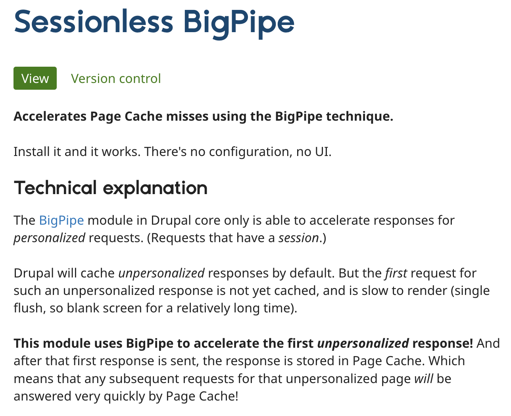
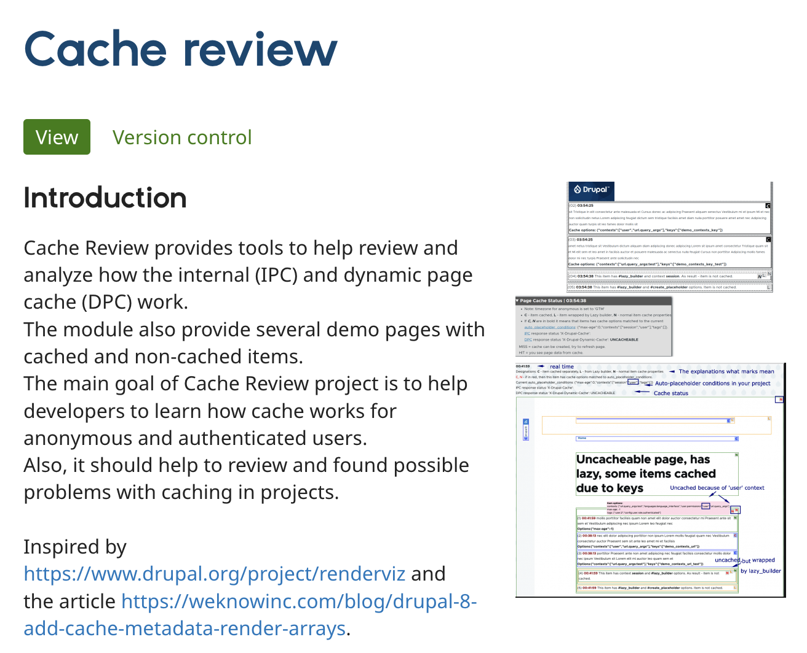

# Some interesting modules...

|
|
|

## Alternate PlaceholderStrategies

AjaxBigPipe module provides an interesting addition: 
**use an IntersectionObserver to be _even lazier_**

It only applies to blocks and is an opt-in replacement.

It will wait for the block to actually enter the viewport 
in order to render the placeholder

|
|
|

## Extending BigPipe to sesionless requests

Sesionless requests are served by Page Cache.

This means the first _HIT_ is expensive.

The Sesionless Big Pipe module accelerates
that first hit by using Big Pipe only then.

|
|
|

## Cache is hard: make your life easier

Adds a visual wrapper around every element.

Indicates cache miss/hits, lazy loaders and auto-placeholdered elements.

Provides some test pages to play with cache.

|
|
|

|
|
|

## Demonstrate BigPipe

Provides helper blocks to:

· Demonstrate Big Pipe

· Turn BigPipe on / off

· Start a session as anonymous user

